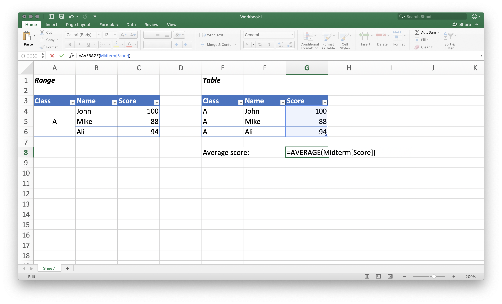
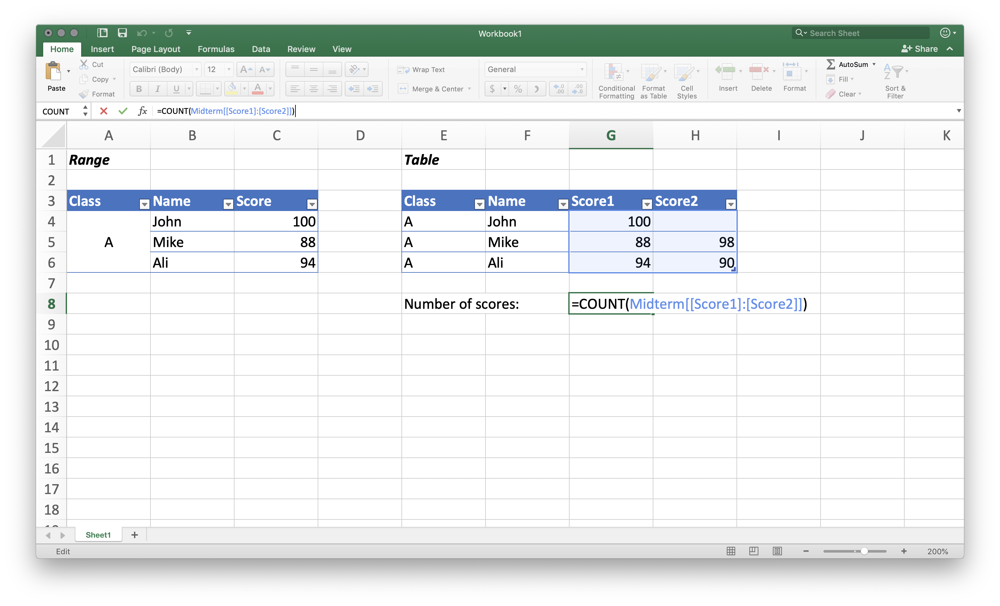
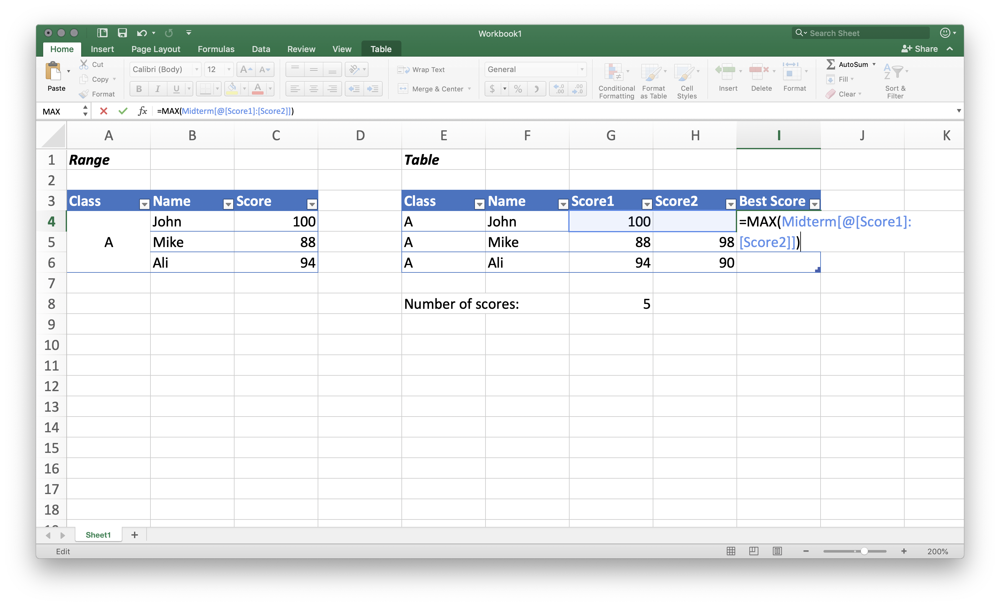
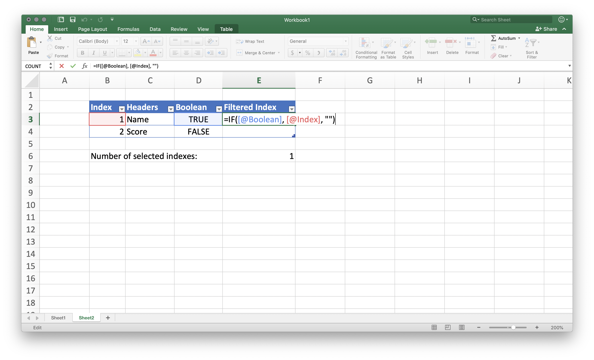

# Accessing Data In a Table

As promised, one of the biggest benefit to use the table in Excel, or to structure the data, is the ease of accessing the columns, rows and cells in a structured way. Therefore we will spend this whole chapter discussing different ways to select data in a table, mainly _slicing_ and _indexing_. Once we cover this step, data analytics is only a matter of _how_ we are going to change that data.

## Finding the Data through Name or Index

There are two ways of finding the data we want in a table: One is through its column name and row name \(or row condition\), and the other one is through its relative location, or **index**. For example, if we want to find John's score in the table below, the name approach is to filter the row first with the "Name" John and to select the "Score" data; the index approach is to directly select the data in the row 1 and column 2.

**Our score example**

| Name | Score |
| :--- | :--- |
| John | 100 |
| Mike | 88 |
| Ali | 94 |

From the user perspective, it is preferable to use the name approach for its **semantics** advantage, even though the name and the index approaches are usually interchangeable. After all, what we want is _the score of John_, not specific to any row or column index. Therefore, instead of using `B2` or _row 1 column 2_, we should leverage the column and row names, and have the algorithm figure out the indexes. This was a point in the previous chapter [_What Is a Table?_](what-is-a-table.md).

On the other hand, if we are not looking for specific data, it might be more succinct to just use the indexes. For example, if we want to add 10 points to everyone's score, it doesn't matter if we are selecting John or Ali's score - we just have to add 10 points to each of the selected score. This merit will become more obvious when designing the loop in Python or R. 

For now, just keep in mind that it is better to leverage the existing headers in the table _when necessary_.

## Slicing and Indexing

After understanding the two approaches to find a data, we can further break the selection process of John's score into four steps as follows, to explain how to index and slice a table.

### Table

1. **Find the index** of the row where the "Name" data equals to "John"
2. **Slice the table** using the row index
3. **Find the index** of the column where the header equals to "Score"
4. **Slice the table** using the column index



| Row Index | Name | Score |
| :--- | :--- | :--- |
| **1** | **John** | **100** |
| 2 | Mike | 88 |
| 3 | Ali | 94 |



| Name | Score |
| :--- | :--- |
| John | 100 |



| Name | **Score** |
| :--- | :--- |
| John | **100** |



| Score |
| :--- |
| 100 |



We can see that the selection process is basically a deletion process. We focus on the target one dimension at a time, and after two rounds, one for columns and the other one for rows, we can locate the data we were looking for.

It is worth noting that in some packages, the end product from the fourth step is a \(1,1\) table, not the value itself, and would require an extra step to extract the data. But except the difference in data types, this is the standard way to locate a cell in a table - first get the index in one dimension, and that use that index to slice the table.

> **In case you're wondering: Table/Matrix Notation \(r,c\)**
>
> When we refer to the size of a table, we should always present the number of rows first, and then the number of columns. It is a convention from matrix, as the notation directly determines whether certain calculations are available between two matrices. Table adopts this convention.

### List

We can of course apply the same process to select multiple rows or columns. If we want to focus on Mike and Ali's score, either to compare or to calculate the average, I can first find the indexes of their rows, and then slice the table using those indexes.



| Row Index | Name | Score |
| :--- | :--- | :--- |
| 1 | John | 100 |
| **2** | **Mike** | **88** |
| **3** | **Ali** | **94** |



| Name | Score |
| :--- | :--- |
| Mike | 88 |
| Ali | 94 |



| Name | **Score** |
| :--- | :--- |
| Mike | **88** |
| Ali | **94** |



| Score |
| :--- |
| 100 |
| 94 |



Again, depending on the data types, the end product we get from step four can be a \(2,1\) table, or a **list** with two elements. List is also a data structure that we can use to store and access data, except unlike table, it is not always two-dimensional; it is usually one-demensional as in this example, or can be nested into multi-dimensional. For now let's focus on the two-element list we got.

The way to index and slice a list is exactly the same as the index approach to our table: we first _find the index_ of the element\(s\), and then _slice the list_ using the index. In the example below, the first two steps are to slice the list using both indexes, and the last two steps using only the first index.



| List Index | Element |
| :--- | :--- |
| **1** | **88** |
| **2** | **94** |



| Element |
| :--- |
| 88 |
| 94 |



| List Index | Element |
| :--- | :--- |
| **1** | **88** |
| 2 | 94 |



| Element |
| :--- |
| 88 |



We can see from the first two steps that after selecting multiple elements in a list, we will still get a list; while selecting only element will get us the value itself. This is also a way to extract data from the \(1,1\) table object.

> **In case you're wondering: Index in Python and R**
>
> Index system is one of the fundamental differences between R and Python. Launched as a statistical language, R uses natural numbers as its index that starts with 1, while Python, a rather classical programming language, uses [non-negative integers](https://en.wikipedia.org/wiki/Integer_%28computer_science%29) as its index that starts with 0.
>
> So to access the first object in a list, in Python you would use `0` as the index, while in R you would use `1` as the index. As usual, we will cover the advanced indexing after the Excel demo.

### Comparison to Where We Started

Although understanding the process of slicing and indexing can seem overwhelming, it is truly how we can navigate efficiently through a \(3,2\), \(30, 20\) or even a \(3000, 2000\) table. When the data grows into _big data_, we can barely use the arbitrary locator like `B2` to find the data we want - we need to leverage the row names and column names. 

And trust me, once you get used to this method, it will feel much more intuitive to locate the data using the name approach. The very moment you start wondering "_What is John's score?_", you will already be slicing the data. This second nature will apply to Excel, R, Python, SQL, and pretty much every data analytics tool you will encounter.

## Slicing a Table in Excel

Based on the knowledge so far, we can already start slicing a table in Excel. Just a heads-up: Excel table offers an amazing support for slicing by column name, but it doesn't fully support slicing by index. We will explain this phenomenon and discuss some alternatives below.

### Slicing by Column Name

Once a range is converted into a table, whenever you start to reference the whole column, Excel will automatically convert the range into a structured reference. So if I want to calculate the average score from this midterm exam, I can just select the whole range as follows:

Let's take a closer look at what Excel has done for us. Inside the `AVERAGE()` formula, the structure reference says `Midterm[Score]`, in which `Midterm` is the table name, and `Score` the column name. It doesn't matter on which sheet or cells our table is placed. As long as we call the table `Midterm`, this will be the only table where the data is referenced. This also implies that both the table name and the column name have to unique.

This structure reference can also be expanded to include multiple columns. Let's say there is an optional second exam for anyone who wants to raise his or her score even higher. If we want to count the number of scores out of these two exams, we can also select the range that contains all of them.

  
We can see from the example above that the structure reference is now `Midterm[[Score1]:[Score2]]`, which means we are selecting the data from column `Score 1` to `Score 2` in the `Midterm` table. 

As I said, Excel did an amazing job in slicing by column name. The auto-completion feature makes it very easy to create and modify the structure references. We can now only focus on the table itself, regardless of which alphanumerical location each cell is located... if we are only dealing with columns.

### Slicing by Row Name

Natively, Excel table doesn't support true slicing by row name, and my wild guess is that this is because assigning _unique_ row names to a table is not a very common practice. 

For example, in our score table, there is no unique row identifier if we add another John or Ali. This is why we should always assign unique, serial row names to the instances, as explained in [_In case you're wondering: Column No._](what-is-a-table.md#table-is-a-2d-container-of-data) __As for now, the _unstructured_ nature of rows or instances in an Excel table makes it hard to apply slicing by row name.

However, Excel table does provide a neat `#ThisRow` or `@` specifier to reference objects on the same row. Suppose we want to calculate the highest score for each student as follows:

The row is now specified as `@` in the structured reference `Midterm[@[Score1]:[Score2]]`, which allows the `MAX()` function to operate on a per row basis. Once we hit enter, the formula will be automatically apply to each cell in the same column, enforcing the data consistency. 

I would say the usage of `@` is not a true slicing by row name - after all, there is no row name or index in this syntax, but it is a good workaround and still helps us keep track of the data in a structured way.`MAX(Midterm[@[Score1]:[Score2]])` makes much more sense than `MAX(G4:H4)`. The also implies that if we want to manipulate the data for each row, we should just create an additional column. 

> **In case you're wondering: Locate a Cell by Its Column and Row Names in Excel**
>
> Technically it is still be possible to locate a cell by its column and row names in Excel. After all as demonstrated in our examples, to locate a cell in a table we just have to slice twice. If we already have the ability to slice a table by its column name, we can further slice the list and locate a specific cell.
>
> However, the limitation of Excel formula, specifically [_array formula_](https://support.office.com/en-us/article/guidelines-and-examples-of-array-formulas-7d94a64e-3ff3-4686-9372-ecfd5caa57c7), makes it complicated to implement such an idea, which kind of defeats our purpose. We will walk through this idea in the [_How to Find an Index_](accessing-data-in-a-table.md#how-to-find-an-index) section, but just keep in mind that it's not very practical to do so in Excel.

### Related Resources

Once you start using table and structure references, it is very easy master the skills. I strongly recommend the official document [_Using structured references with Excel tables_](https://support.office.com/en-us/article/using-structured-references-with-excel-tables-f5ed2452-2337-4f71-bed3-c8ae6d2b276e) as it provides a very detailed walkthrough on all the features. It also helps me understand the limits and best practices of using the table feature.

> **In case you're wondering: Writing Structured Formula outside of Excel**
>
> It is not uncommon to write formula outside of Excel when generating an Excel workbook in Python or R, and if that's the case for you, I have a not-so-good update: the package is unlikely to support the `@` specifier, and you might still have to use alphanumeric locator. I ran into errors when I tried this with the `pandas` / `xlsxwriter` packages in Python.
>
> One reason \(again, my wild guess\) is that the formula written externally to an Excel document is not calculated before the file is first run by Excel, and the `@` specifier requires that calculation right when it's assigned. Therefore, whenever we use `@` in an Excel table, the _real location_ is actually calculated and recorded in the configuration; if we just write `@` without that additional configuration, Excel would just see the `@` specifier in the formula as an error.

## How to _Find_ an Index?

I hope the indexing and slicing process makes sense so far, except you might be wondering _how exactly does the program find the index_? Specifically, how do we design a process that takes, for example, "Name" and returns the column index 2 in our table?

Simply put, the way a computer finds the index is to first **evaluate** the condition against each data point, and then **filter** the index that fit the condition. Following is an example how the computer would find "Name" among the headers.

| Step | Action | Name | Score |
| :--- | :--- | :--- | :--- |
| 0 | Index the headers | 1 | 2 |
| 1 | Compare each header with "Name" | **True** | False |
| 2 | Filter the index | **1** | \(Null\) |

This is the process that connects the name with the index, and I use this trick a lot to design processes. Let's illustrate step 1 and 2 in greater details below.

### Evaluating the Condition

To know which specific data fits our condition, the best way is compare the condition against each data point, and record whether the reponse is true or false. So if we want to know which header is _Name_, we would go through each header and check whether it equals to _Name_.

In programming, the condition we set is called a **boolean expression**, and it will generate a **boolean data**, which is just a fancy name for the true or false we are looking for. We may also use **boolean operators**, such as _and_ and _or_, to combine multiple boolean expression into one. Following is an example using the Excel-style formula.

| Boolean Expression 1 | Boolean Operator | Boolean Expression 2 | Boolean Data |
| :--- | :--- | :--- | :--- |
| \(3&gt;5\) | - | - | FALSE |
| \(10&gt;7\) | - | - | TRUE |
| \(3&gt;5\) | AND | \(10&gt;7\) | FALSE |
| \(3\*5=15\) | OR | \(2\*3=7\) | TRUE |

Naturally, we can combine as many boolean expressions as we want using the boolean operators. With two kinds of boolean operators and three unique combinations between true and false, there are six possible ways to combine two boolean data.

**Combining Two Boolean Data**

| Boolean Data | Operator: And | Operator: Or |
| :--- | :--- | :--- |
| True, True | True | True |
| True, False | False | True |
| False, False | False | False |

Finally, we can **negate** a condition. For example in Excel we can use the function `=NOT()` to flip a boolean response. 

Understanding these rules can help us generate a list of boolean data to filter another list \(at the same length, of course\). Now we can specify the header searching process into following steps, with Excel-style formula:

1. Construct a boolean expression: `(h="Name")`
2. For each element in the header `["Name", "Score"]`, evaluate it with the expression
3. Generate the boolean list: `[TRUE, FALSE]`

Similarly, if we want to select both _Name_ and _Score_, we can jsut tweak the boolean expression.

1. Construct a boolean expression: `OR((h="Name"), (h="Score"))`
2. For each element in the header `["Name", "Score"]`, evaluate it with the expression
3. Generate the boolean list: `[TRUE, TRUE]`

> **In case you're frowning: The Equality Sign "="**
>
> In Excel, the formula use single equality sign `=` for both variable assignment and equality evaluation, because only the first one is used for variable assignment, and the rest are all treated as equality evalution.
>
> This is obviously not the case with Python or R, as the equality sign can appear anywhere in the vast script. Therefore, both Python and R use double equality sign `==` for equality evaluation, and `=` exclusively for variable or argument assignment. The other operators: `>`, `<`, `>=`, `<=`, are exactly the same.

### Filtering the Index

With the boolean list generated, this step should be fairly straightforward - we just have to filter the index whose corresponding evaluation result is true. This can be easily done in an Excel table.

In the screenshot we can see that by using a row-based `IF()` function, we can easily filter the index column by the boolean column. If the boolean is `TRUE`, the cell will reference the `Index` column on the same row; if not it will return an empy string. We can finally use the list of indexes to access the data in a table. Hurray!

> **In case you're wondering: Vectorization**
>
> Besides checking each element one by one, we could also leverage _vectorization_, also known as [_array programming_](https://en.wikipedia.org/wiki/Array_programming), to achieve extremely faster calculation. In our example, we may use matrix multiplication to improve the efficiency.
>
> The underlying idea is that since true and false can be calculated as 1 and 0, and any number multiplied by 0 will be 0, so we may construct the index \(2,1\) and boolean \(2,1\) matrices in a way that when they multiply, we will get a \(2,1\) matrix with only the valid index left. A detailed walkthough is as follows. 
>
> 1. Transpose the index matrix into a \(1,2\) matrix
> 2. Concatenate the boolean matrix by itself into a \(2,2\) matrix
> 3. Multiply the two matrices, \(1,2\) x \(2,2\). The result will be a \(1,2\) matrix.

> **In case you're worrying: Vectorization**
>
> Most of the functions in popular packages should already be optimized through vectorization, so don't be worried if you don't feel familiar. Just keep in mind that code optimization is an ongoing effort, and there can be some better but less straightforward ways in processing the data.

