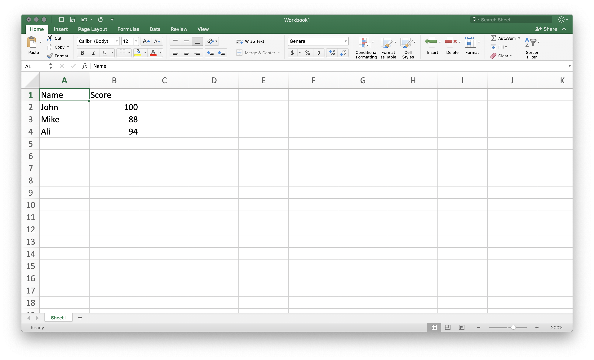
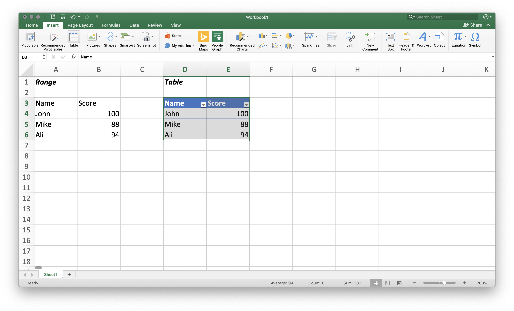
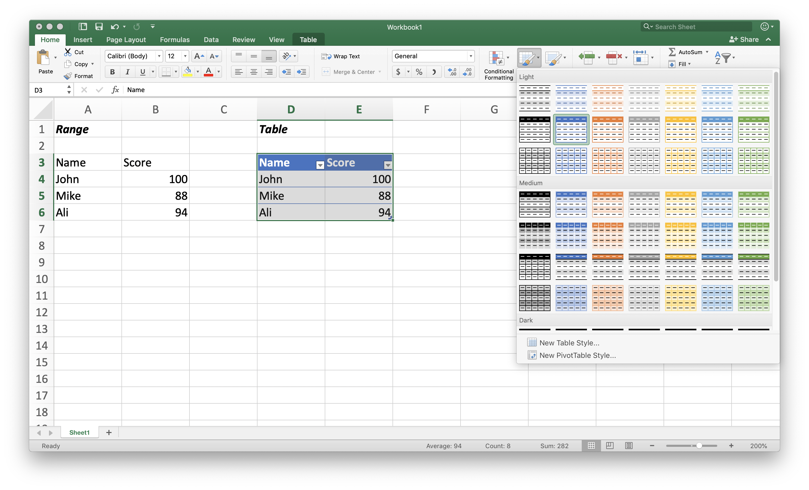
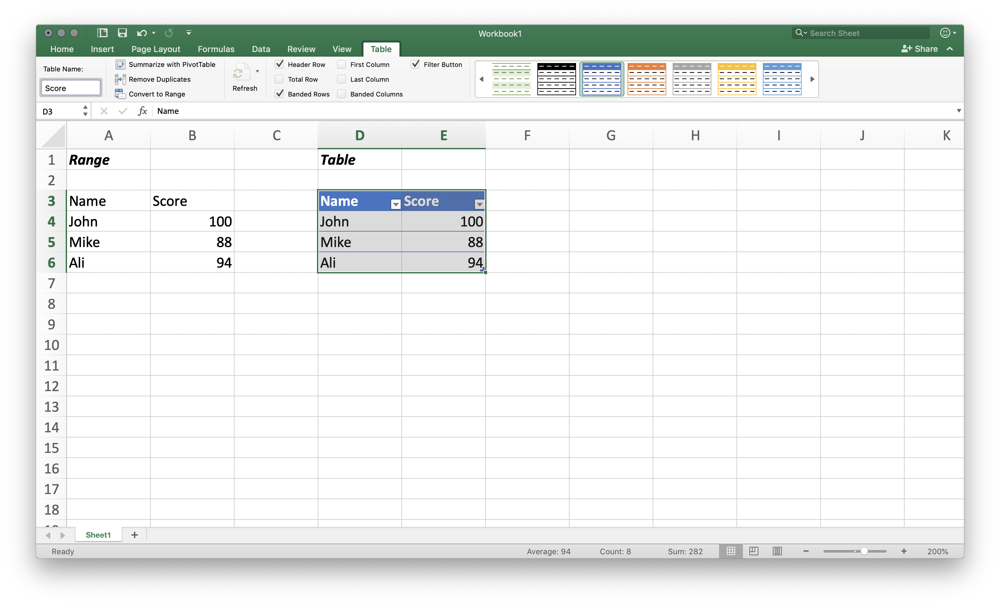
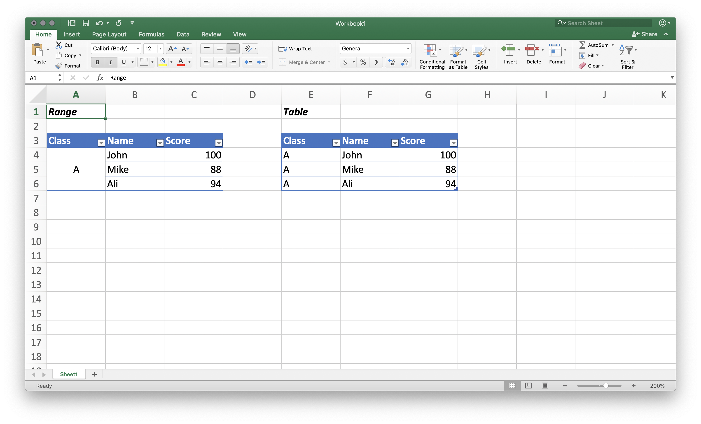

# What Is a Table?

The very first thing we will talk about is table. Table is so common, so powerful that it appears in every level of the world of data, yet it is also the first thing to know to master business analytics. No matter which tool you are using, understanding the structure and the relationship of a table, from how to select a single cell in a table, to how to apply changes to rows and columns, will help you reach the best practices as soon as possible. So let's take a step back and review this question: _What is a table_?

## Table Is a 2D Container of Data

From a very high level, I think it's safe to say table is a two-dimensional container of data. For example, a balance sheet that contains the asset, liability and equity information can be viewed as a table; an invoice you just got from a store, online or offline, that lists the item, quantity and price information, also contains a table. A table is generally a two-dimensional container of data.

If we take a closer look at a table, it should always consist of three elements: **row**, **column**, and **cell**.

| \_\_ | Column Name |
| :--- | :--- |
| Row Name | Cell |

Columns are the vertical dividers of a table, with a column name on the top, usually called as a header. Similarly, rows are the horizontal dividers of a table, and on the very left there is a row name, although sometimes ignored or simply put as a serial. 

To put this in an Excel analogy, the `A, B, C, D, E...` you're seeing on the top of the table are the headers, while the `1, 2, 3, 4, 5...` on the left of the table are the row names; when you click on the header `A`, the area selected is a column, and if you click on the row name `1`, the area selected is a row. 

Naturally, the intersection between a row and a column is called a cell. A cell usually holds the _actual_ data we care about, and the column and row names help us interpret that data. 

So if I want to use a table to document my favorite snacks, it will looks as follows. The column names are _No._, _Item_, _Quantity_, and _Price_; the row names are 1 and 2. These names help us select the data we are looking for. If I want to know the price of A-Sha Dry Noodle, I can just select the first row and look at its _Price_ column.

| No. | Item | Quantity | Price |
| :--- | :--- | :--- | :--- |
| 1 | A-Sha Dry Noodle | 3 | $10.99 |
| 2 | Almdudler Soda | 4 | $24.16 |

> **In case you're wondering: Column** _**No.**_
>
> You might be wondering "Why don't we just assign the _Item_ column as the row names"? Actually we could and that would increase the readability of this table a little bit. Here I decided to assign a separate column to illustrate the importance of the row numbers, and I will explain later why it might be a good idea sometimes.

### Difference between Rows and Columns

Although sometimes columns and rows may seem very similar and interchangable, there is a fundamental difference between them - columns should be used to document different properties or variables of an instance, and rows should be used to document one or more instances. For example, if we want to create a table that contains the score of each student in a class, the best practice is to assign a column for the scores, and multiple rows for different students.

**A Good Practice**

| Name | Score |
| :--- | :--- |
| John | 100 |
| Mike | 88 |
| Ali | 94 |

**A Not-so-good Practice**

| Name | John | Mike | Ali |
| :--- | :--- | :--- | :--- |
| Score | 100 | 88 | 94 |

Technically we can still document and access all the data in both tables, just through different terms, but the difference becomes more obvious when we have a huge amount of data. 

One major difference is the readability. Suppose we have one hundred instead of three students, the first table would just extend vertically and we could still read or print, while the second table would extend horizontally and we would need to find a lengthy piece of paper to print it. 

The other difference is the interpretation. In the second table, one lengthy row with many properties reads like we only have one instance that contains multiple properties, while the first table should have a better chance to show that we are presenting or comparing one property across multiple instances.

In fact, most of the analytical tools I use, including Excel, distinguish between columns and rows very much and design their built-in functions by assuming columns are for variables and rows are for instances. So it usually will save a lot of time if you create or convert a table in such a fashion.

Finally, it is not a big deal if you come across tables like the one in the second example. You may just **transpose** them by switching the columns with the rows. Sometimes it might actually make sense to use columns for the instances. The bottom line is if you are presenting the data to your boss, a data analyst, or a boss who happens to be a huge data guy, you should always use columns for the properties and rows for instances.

> **In case you are wondering: Matrix**
>
> A matrix is similar to a table except the fact that it should only contain computable numbers - integers, floats or even complex. Naturally, the main usage of a matrix is to compute numbers, while that of a table is to document and present the data in many different types. 
>
> You may add, abstract or multiply two matrices, but you could seldom do any of those with tables.That's why in order to apply some machine learning algorithms to the data in a table, sometimes we would need to extract and encode the data into a matrix first.

## Creating a Table in Excel

Now let's use Excel to create some tables. As explained above, the interface of Excel itself looks like a huge table with alphabets as its headers and numbers as its row names. In the Excel 2016 on Mac, there are 16,384 columns and 1,048,576 rows. As a reminder, these limits strengthen the idea that we should use columns for variables and rows for instances.

To create a table, let's type in the data from our score example first.



### A Range with Data Is Not Yet a Table

At the first glance, the data in the range `A1:B4` looks exactly like a table. It has the columns, rows, and cells, and we can already use it to document and reference the data. But to apply what we have learned about a table, it is worth noting that we have not created a **table** yet - we have simply filled the data in a specific **range**.

The deciding difference between a range and a table is the structure, and the definition and requirement that comes with that structure. In our first try above, there is basically no structure to define what the columns and rows are, except the fact that we can tell them conventionally. As a result, Excel does not have a structured or computational way to read the data in a range. If we want to access to John's score, we could only refer to the cell `B2`, but `B2` is just an arbitrary code in our range. It doesn't carry the meaning embedded in the column or row names.

Lack of the structure also makes the range prone to human errors. Without the requirement, we could easily create "tables" that don't have the headers, or have duplicate headers. A table without proper structure can often cause confusion and rework, and mostly importantly, it usually misses out the capacity and efficiency a tool truly offers. So it is essential to create the table correctly at the beginning.

Although the discussion about table and range is within the scope of Excel's functionality, understanding different data types and choosing the correct one for your data is generally a good practice when dealing with data. We will talk more about the data types in the following chapter. As for now, the only takeaway is make sure to utilize the table function when you're using Excel.

### Converting a Range into a Table

There are two ways I found in Excel to define a table: One is to use the `Table` button on the `Insert` tab, and the other one is to directly set the format through the `Format as Table` button on the `Home` tab. Both will generate the same result, and I personally prefer the second one as a shortcut.





After creating the table, you may configure its name in the new Table tab. Needless to say, it is  strongly recommended to assign a meaningful name for the ease of future reference, so here I assign a name "Score" to the table. You may also convert the table back to a range, as we will revisit the difference between range and table in more details.



### Difference between Range and Table

The main difference between a range and a table, as explained, is the way we reference them. A range can only be referenced using arbitrary code such as `B4`, but a table can be referenced using the meaningful row and column names, which we will cover soon. It's also worth noting that the format is not a deciding factor here, as we could perfectly configure the header, filter and border of a range as well.

The structure in a table also helps to ensure the data integrity, as shown in the comparison of the available functionalities below. 

| Functionality | Range | Table |
| :--- | :--- | :--- |
| Header | Optional | Mandatory\* |
| Duplicate/empty headers | Allowed | Prohibited |
| Merge cell | Allowed | Prohibited |
| Structured reference | Not supported | Supported |

_\*Can be set to hidden in the Table tab._

Sometimes converting a range into a table can be a tradeoff between data presentation and data integrity, as a table has less flexibility in presenting the data, while a range has less control over the data. The bottom line here is to clarify the use case and to choose the right format as necessary.



After using the Table function in Excel, we have successfully created our table, and in a broader sense, structured our data in a way that is friendly and useful to both user and machine. As stated, table is the most fundamental element in data analytics - it is usually the interface between the user and the data. We will talk about how to select and manipulate specific data in a table. 

> **In case you're wondering: Pivot Table**
>
> With "table" in its name, pivot table is a different object from a table in Excel, typically a summary of another table. Turning a range into a table will enable us to summarize the data using pivot table, but please keep in mind that they are better treated as two different objects for different purposes.
>
> We can also reference the data in pivot table in a structured way using the _GetPivotData_ function, which we will not cover here but I strongly recommend to read through [its usage](https://support.office.com/en-us/article/getpivotdata-function-8c083b99-a922-4ca0-af5e-3af55960761f). Quick tip: you don't need to write the _GetPivotData_ formula from scratch; instead just type "=" in the formula field and select the cell you want to reference. The formula will be auto-completed!

## Creating a Table in Python or R

The way to create a table in Python or R is basically the same as we did in Excel, except the fact that we don't have a _preset grid of cells_ to assign each value. We use **variables** \(essentially the code for used memory spaces\) instead. So a direct copy to our example above will be like this:



```python
# this code is written in Python but also works in R

# quote or semi-quote is used to assign string value
A1 = "Name" 
B1 = "Score"

# numbers or floats don't require quotes
A2 = "John"
B2 = 100

A3 = "Mike"
B3 = 88

A4 = "Ali"
B4 = 94
```



Here I used the variable names to imitate the cell locator in Excel and to illustrate the point that there actually no point to do so. We can call the variable whatever we want. So an adaption using this fact will be like this:



```python
# this code is written in Python but also works in R

header_1 = "Name" 
header_2 = "Score"

name_1 = "John"
score_1 = 100

name_2 = "Mike"
score_2 = 88

name_3 = "Ali"
score_3 = 94
```



The code looks good as if we can read on and on to get the score of everybody, but what's missing here is the same element we were looking for in an Excel range - the structure that maintains data integrity. 

What if we have to document the score for a hundred of students? How can we ensure the number after the underscore always matches? And in that sense, does the number even matter \(e.g. what if we assign Mike to `name_3` and Ali to `name_2`, and their scores respectively\)? So there ought to be a structure like table to help us manage the data.

### Creating a Data Frame

It turns out there are multiple ways to help us achieve this goal. One common way is to use a **data frame** object, which provides exactly what we are looking for: header, column, row, and a structured way to access each of them. Without getting into to much detail, creating a data frame follows three simple steps:

1. Identify and load the data frame function
2. Structure the data in a consumable way to the data frame function
3. Apply the data frame function to return the object to our variable

So an example in Python will be as follows. A little bit explanation for line 2: as Python is a versatile tool, we usually launch it without any additional packages and only import the necessary ones. Here we import the [_Python Data Analysis Library_](https://pandas.pydata.org), coded as `pandas`, into the console under the name `pd`.



```python
# 1. Identify and load the data frame function
# import the pandas package under the name pd
import pandas as pd

# 2. Structure the data in a consumable way to the data frame function
# 2-1. Structure the data by its column (property)
# brackets create a list object where we can store multiple values
name = ["John", "Mike", "Ali"]
score = [100, 88, 94]
# 2-2. Put the lists into a dictionary object, consumable to the function
dictionary = {"Name": name, 
              "Score": score}
# PS. These steps can also be done at once
dictionary = {"Name": ["John", "Mike", "Ali"], 
              "Score": [100, 88, 94]}

# 3. Apply the data frame function to return the object to our variable
# assign the data frame to the variable table_3
table_3 = pd.DataFrame(dictionary)

# Take a look at the table
print(table_3)
# Output:
#    Name  Score
# 0  John    100
# 1  Mike     88
# 2   Ali     94
```



Setting aside the new terms like the `list` and `dictionary` \(and I apologize for the confusion\), what we did in step two and three was nothing more than filling the data in a range, and click on the Table button in Excel. It follows the same process, and the goal, again, is to structure the data in a table.

One huge advantage to construct tables in Python or R is the flexible and powerful process we can build to process the data. These packages have so much more to offer than the built-in Excel functions, and it is also extremely efficient to execute the process with script, instead of drag-and-drops. 

However, keep in mind that data analytics skills don't always equate to programming skills. In the walkthrough of table we can see the concept applies to both Excel, Python and R, and the key to becoming a successful data analyst or scientist, in my opinion, is to keep a structured mindset.

> **In case you're frowning: Tibble**
>
> Tibble is a data-frame-like object in R that aims to update some of the old conventions in a data frame. In terms of structure, a tibble is basically the same as a data frame, both with columns, rows, and column and row names. A detailed walkthough of tibble and the comparison of the two can be read in [_R for Data Science_](http://r4ds.had.co.nz/tibbles.html).

## Creating a Table Including Hundreds of Instances

Finally, which tool should we use if we want to, for example, document the scores for hundreds of students? The best way is to use the document application such as Excel or other reporting tools at the beginning, and then load that data into the programming console.

It is not a very good idea to create a table in Python as we demonstrated above for a very obvious reason: _the console doesn't make the bookkeeping activity easier_. Therefore, for better user experience or efficiency, it is generally a good idea to collect the data from the specific tool insteading recreating them in the console. 

Luckily, most \(if not all\) of the data analytics tools support importing data from an external location, and as tempting as it may look, you should always avoid embedding excessive data in the analytical process. Below is an example that loads a csv file into the Python console.



```python
import pandas as pd

# suppose we already saved the example above as a csv file called table.csv

# read the table.csv in the working directory
table_4 = pd.read_csv('table.csv')

# Take a look at the table
print(table_4)
# Output:
#    Name  Score
# 0  John    100
# 1  Mike     88
# 2   Ali     94
```



### Separation of Concerns and the Structure

In a broader sense, the idea of creating separate external file is related to a design principle in computer science called [Separation of Concerns \(SoC\)](https://en.wikipedia.org/wiki/Separation_of_concerns). Based on SoC, we should always separate a program into dinstinct, single-purpose sections that address separate concern. Similarly, we should also separate the analytical process into distinct steps with its own set of tools to ensure best efficiencies.

A violation of SoC might sometimes be the reason why an Excel workbook or a script is so difficult to understand - because everything is just tangled \(or [_coupled_](https://en.wikipedia.org/wiki/Coupling_%28computer_programming%29)\). A better way is to keep the processes \(the verbs, the excel formula\) separate from the data \(the nouns, the actual data\). We will talk more about the process when we start to manipulate the data.

**An Implementation of SoC in Excel**

| Sheet | Step | Function |
| :--- | :--- | :--- |
| Score | 1 | To record the score data of a class |
| Statistics | 2 | To calculate the counts in each score segment |
| Chart | 3 | To visualize the distribution from the statistics |

As we will gain more and more flexibility and capacity to build amazing processes around our data, it is important to keep the structured mindset: using the table \(and other data types\) to structure the data, using different steps to structure and processes and their toolsets, and using different concepts to structure the ever-changing landscape of business analytics.

Thanks for reading through this lengthy note, and I wish the best for your journey in business analytics.

Jimmy

